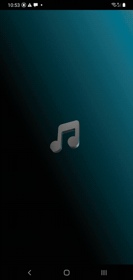
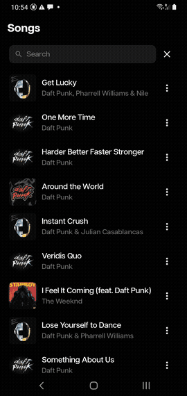
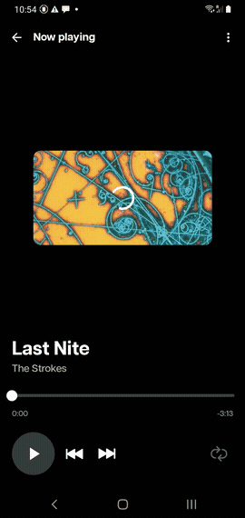
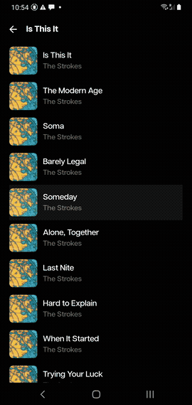

# iTunes Player

An Android music player that searches and streams 30-second previews from the iTunes catalog. Built entirely with Kotlin and Jetpack Compose, following a clean multi-module MVVM architecture.

---

## Demo

| Home & Shimmer | Search | Player | Album |
|:-:|:-:|:-:|:-:|
|  |  |  |  |

---

## Architecture

The project is split into four Gradle modules with a strict one-way dependency graph:

```
:app  ──►  :domain  ◄──  :data
```

| Module | Role |
|---|---|
| `:domain` | Pure Kotlin JVM. Models, repository interfaces, and use cases. Zero Android imports. |
| `:data` | Android library. Repository implementations, Retrofit/Moshi API client, Paging source. |
| `:app` | Application entry point. Wires all modules, hosts all Compose screens. |

### Pattern

```
Composable  →  ViewModel  →  UseCase  →  TrackRepository (interface)
                                               ↓
                                        TrackRepositoryImpl (:data)
                                               ↓
                                         ItunesService (Retrofit)
```

- Single `ComponentActivity` (`MainActivity`) manages a lightweight custom backstack — no Jetpack Navigation XML.
- ViewModels expose `StateFlow`; Composables collect with `collectAsState()`.
- No `LiveData`, no `Fragment`, no XML layouts.

---

## Features

- **Default feed** — opens with Daft Punk tracks so the list is never empty on first launch.
- **Live search** — real-time paging search against the iTunes Search API; results update as you type.
- **30-second preview player** — streams the iTunes preview URL via `MediaPlayer` with play/pause, seek slider, repeat, and elapsed/remaining time counters.
- **Album view** — tap a track title/artist or "View album" from the action sheet to see every track on that album grouped together.
---

## Tech Stack

| Area | Library / Tool |
|---|---|
| Language | Kotlin 2.0.21 |
| UI | Jetpack Compose + Material 3 |
| Architecture | MVVM, StateFlow, ViewModel |
| Networking | Retrofit 3 + Moshi |
| Paging | Jetpack Paging 3 (`PagingSource`, `cachedIn`) |
| Image loading | Coil |
| DI | Manual constructor injection (no Hilt/Dagger) |
| Testing | JUnit 4, MockK, `kotlinx-coroutines-test`, Paging testing |
| Min SDK | 27 (Android 8.1) |
| Target SDK | 36 |

---

## Module Structure

```
itunesPlayer/
├── app/
│   └── ui/
│       ├── home/          HomeScreen + HomeViewModel
│       ├── player/        PlayerScreen + PlayerViewModel
│       ├── album/         AlbumScreen + AlbumViewModel
│       ├── components/    TrackItem, TrackActionSheet, TrackItemShimmer
│       ├── splash/        SplashScreen
│       └── theme/         ItunesPlayerTheme, Typography, Colors
├── domain/
│   ├── model/             Track
│   ├── repository/        TrackRepository (interface)
│   └── usecase/           GetTrackUseCase, SearchTracksUseCase,
│                          GetPagedTracksUseCase, GetAlbumTracksUseCase
└── data/
    ├── remote/            ItunesService, TrackDto, SearchDto
    ├── remote/paging/     TrackPagingSource
    └── repository/        TrackRepositoryImpl
```

---

## Getting Started

1. Clone the repository.
2. Open in Android Studio Hedgehog or later.
3. Run the `:app` configuration on a device or emulator running API 27+.

No API keys required — the iTunes Search API is open.

---

## Future Backlog (Ideas)

### Core player
- [ ] Mini player.
- [ ] Queue management — add tracks to an up-next queue, reorder and remove items.
- [ ] Background playback — foreground `Service` + `MediaSession` so audio continues when the app is minimised.
- [ ] Lock-screen / notification controls — standard media notification with play/pause/skip actions.
- [ ] Crossfade between tracks.

### Discovery
- [ ] Artist detail screen — tap an artist name to see all their available tracks.
- [ ] Genre filter chips on the home screen.
- [ ] Related tracks section at the bottom of the player screen.

### Persistence
- [ ] Favourites — bookmark tracks locally with Room; offline-readable list.
- [ ] Recently played history.
- [ ] Search history with quick-clear.
- [ ] Download previews for offline playback.

### UX & polish
- [ ] Animated now-playing bar pinned to the bottom of the home and album screens.
- [ ] Haptic feedback on play/pause.
- [ ] Landscape / tablet adaptive layout.
- [ ] Android Auto

### Infrastructure
- [ ] Crashlytics + analytics integration.
- [ ] Screenshot and end-to-end tests with Compose test rules.
